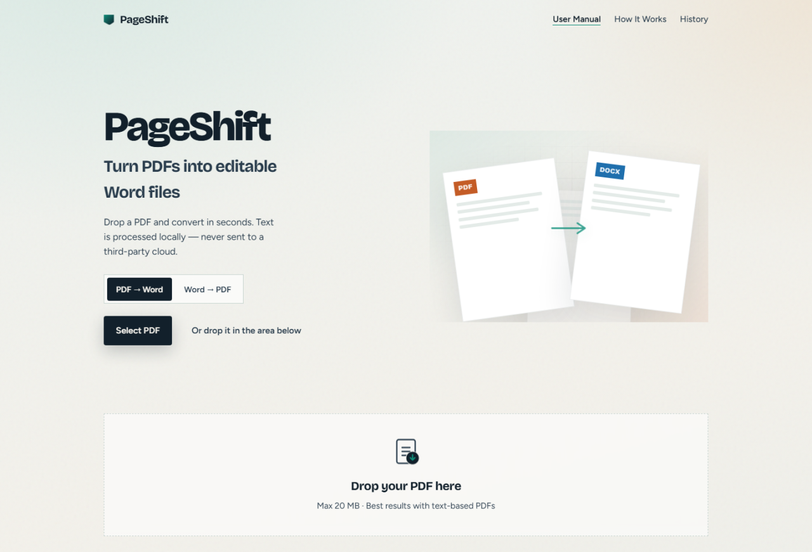
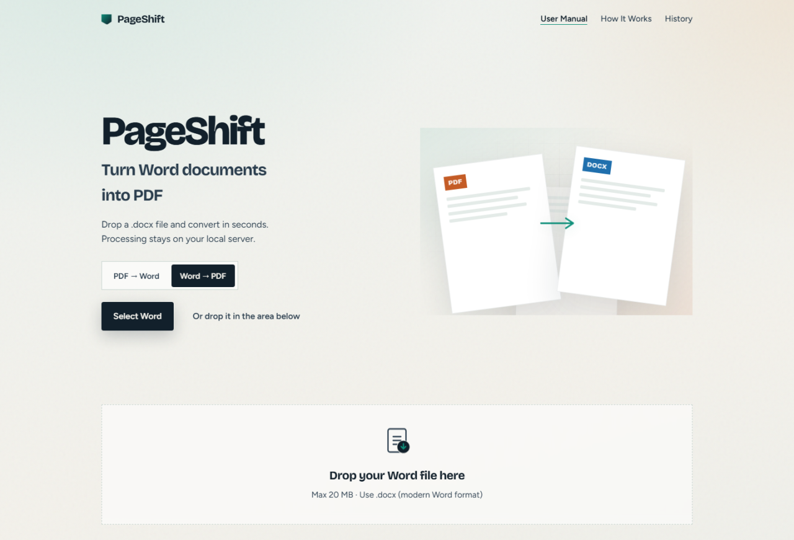
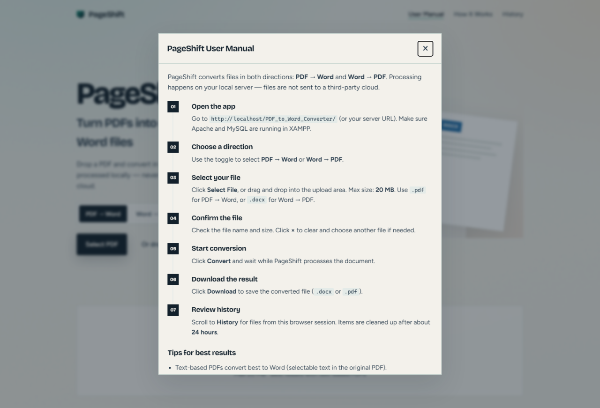
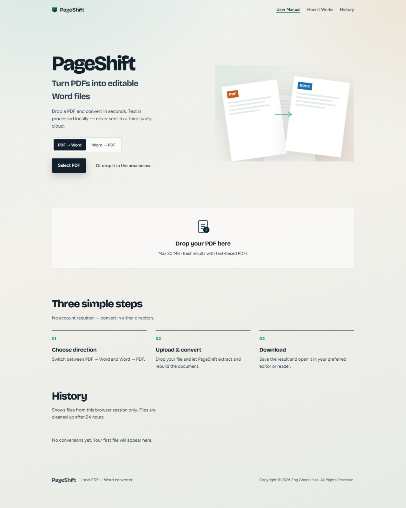

# 📄 **PageShift — PDF ↔ Word Converter**

A modern **PDF to Word** and **Word to PDF** converter built with **Native PHP**, **MySQL**, **HTML**, **CSS**, and **JavaScript**.
Drop a file, pick a direction, and download the result — processed **locally** on your XAMPP server.

✨ Feel free to explore, contribute, and enhance the project! 🚀

---

## 🎬 **Project Demo Video**

📺 Watch the full system demo (PDF → Word, Word → PDF, User Manual & more):

<p align="center">
  <a href="https://drive.google.com/file/d/1iz1J0Am5K1YHtVzvNQtE579qs3QlzUmZ/view?usp=sharing">
    <strong>👉 Watch on Google Drive</strong>
  </a>
  <br/>
  <sub>https://drive.google.com/file/d/1iz1J0Am5K1YHtVzvNQtE579qs3QlzUmZ/view?usp=sharing</sub>
</p>

---

## ✨ **Features**

- 🔁 **Two-way conversion** — **PDF → Word** and **Word → PDF**
- 🖱️ **Drag & drop upload** — or click **Select PDF / Select Word**
- 🧩 **Stacked layout** — text stays with text, photos stay on their own line
- 🖼️ **Keeps images** — screenshots and photos are carried into the output file
- 💻 **Code-friendly** — PHP / JSON blocks keep line breaks
- 📖 **Built-in User Manual** — full English guide from the top navigation (one click)
- 🕘 **Conversion history** — this browser session only · auto-clean after 24 hours
- 🔒 **Local processing** — files are not sent to a third-party cloud
- 📱 **Responsive UI** — modern PageShift design for desktop and mobile

---

## 🏗️ **Tech Stack**

| **Category** | **Technology** |
| --- | --- |
| 🎨 **Frontend** | HTML5, CSS3, JavaScript |
| ⚙️ **Backend** | Native PHP 8+ |
| 🗄️ **Database** | MySQL (`pdf_to_word`) |
| 📚 **Libraries** | PHPWord, smalot/pdfparser, TCPDF |
| 🖥️ **Server** | Apache (XAMPP) |

---

## 🖼️ **Project Screenshots**

<p align="center">
  
  <br/>
  <em>🏠 Home / PDF → Word — brand intro, direction toggle, and drop zone</em>
</p>

<table>
  <tr>
    <td width="50%" align="center">
      <br/>
      <strong>📝 Word → PDF</strong><br/>
      <sub>Switch direction and drop a .docx file</sub>
    </td>
    <td width="50%" align="center">
      <br/>
      <strong>📖 User Manual</strong><br/>
      <sub>Step-by-step English guide from the top navigation</sub>
    </td>
  </tr>
  <tr>
    <td width="50%" align="center">
      <br/>
      <strong>🕘 How It Works &amp; History</strong><br/>
      <sub>Three steps plus session conversion records</sub>
    </td>
    <td width="50%" align="center">
      <br/>
      <strong>📂 Drop Zone</strong><br/>
      <sub>Drag a file or click Select PDF / Select Word</sub>
    </td>
  </tr>
</table>

---

## 📦 **Requirements**

- 🧰 XAMPP (Apache + MySQL + PHP 8.0+) **or** a similar local stack
- 🧩 PHP extensions: `pdo_mysql`, `fileinfo`, `mbstring`, `zip`, **`gd`**
- 📦 [Composer](https://getcomposer.org/) (to install PHP libraries)
- 🧭 Modern browser (Chrome / Edge / Firefox)
- ✅ JavaScript enabled

> ⚠️ **GD is required** for images. In `C:\xampp\php\php.ini` set `extension=gd`, then restart Apache.

---

## 🚀 **Installation**

1. 📁 Place the project in your web root, for example:

   ```text
   C:\xampp\htdocs\PDF_to_Word_Converter
   ```

2. 📦 Install PHP dependencies:

   ```bash
   composer install
   ```

3. ▶️ Start **Apache** and **MySQL** in the XAMPP Control Panel.

4. 🗄️ The `pdf_to_word` database and `conversions` table are created automatically on first convert.

5. 🌐 Open the app:

   ```text
   http://localhost/PDF_to_Word_Converter/
   ```

6. 📖 Click **User Manual** in the top bar for the full guide.

### ☁️ **Deploying to cPanel / hosting**

XAMPP defaults (`root` / empty password / database `pdf_to_word`) **will not work** on cPanel. That is what caused `api/history.php` and `api/convert.php` to return HTTP 500.

1. 📤 Upload the full project, **including the `vendor/` folder** (Git does not include it).
2. 🗄️ In cPanel → **MySQL Databases**, create a database and a user, then add the user to the database with **ALL PRIVILEGES**.
3. 🧰 Open the installer once:

   ```text
   https://engchoonhao.kolejsynergy.com/PDF_to_Word_Converter/install.php
   ```

4. ✅ Enter host `localhost`, plus the cPanel database name / user / password, then save.
5. 🩺 Confirm everything is green:

   ```text
   https://engchoonhao.kolejsynergy.com/PDF_to_Word_Converter/check.php
   ```

6. 🗑️ Delete or rename `install.php` after a successful install.
7. 🌐 Use the app at:

   ```text
   https://engchoonhao.kolejsynergy.com/PDF_to_Word_Converter/
   ```

> ⚠️ If `vendor/` is missing, convert cannot run. Zip `vendor` from your PC and extract it next to `index.php`.

---

## 🧭 **How to Use**

1. 🔀 Choose **PDF → Word** or **Word → PDF**
2. 📂 Select or drop a file (max **20 MB** · `.pdf` or `.docx`)
3. ⚙️ Click **Convert**
4. ⬇️ Download the result
5. 🕘 Scroll to **History** to grab earlier files from this session

### 📌 **Best results**

- ✅ Text-based PDFs (you can select/copy text)
- ✅ Modern Word **`.docx`** (legacy `.doc` is not supported)
- ❌ Scanned / image-only PDFs (no OCR in this version)

---

## 📁 **Folder Structure**

```text
PDF_to_Word_Converter/
├── api/
│   ├── convert.php          # Upload + convert
│   ├── download.php         # Secure download
│   └── history.php          # Session history
├── assets/
│   ├── css/style.css
│   └── js/app.js
├── docs/
│   └── screenshots/         # README project screenshots
├── includes/
│   ├── config.php
│   ├── db.php
│   └── functions.php        # PDF ↔ Word conversion
├── sql/
│   └── schema.sql
├── uploads/                 # Incoming files (blocked by .htaccess)
├── outputs/                 # Converted files (blocked by .htaccess)
├── index.php
├── install.php             # cPanel MySQL setup (delete after use)
├── check.php               # Hosting health check
├── README.md
├── CONTRIBUTING.md
└── LICENSE
```

---

## 🗄️ **Database**

Table `conversions` stores each job: original name, direction (`pdf_to_word` / `word_to_pdf`), status, page count, and timestamps.

Files on disk are cleaned up after **24 hours**.

---

## ⚙️ **Configuration**

On cPanel, run `install.php` or copy `includes/config.local.example.php` to `includes/config.local.php` and fill in the live MySQL name, user, and password.

Edit `includes/config.php` for max file size and copyright:

```php
define('APP_COPYRIGHT_NOTICE', 'Copyright © 2026 Eng Choon Hao. All Rights Reserved.');
```

Default MySQL user is XAMPP `root` with an empty password.

---

## 🔒 **Security Notes**

- 🧪 Upload checks: MIME type + `%PDF-` / DOCX zip magic bytes
- 🛡️ All SQL uses PDO prepared statements
- 🧼 Outputs escaped with `htmlspecialchars`
- 🚫 Direct access to `uploads/` and `outputs/` is denied
- 🍪 Downloads are limited to the current browser session

---

## 🤝 **Contributing**

Contributions are welcome! Please read [CONTRIBUTING.md](CONTRIBUTING.md) before opening a pull request.

💡 To contribute, check the guidelines and open a PR with a clear description of what you changed.

---

## 📜 **License**

This project is licensed under the [MIT Non-Commercial License](LICENSE).

---

## ©️ **Copyright**

**Copyright © 2026 Eng Choon Hao. All Rights Reserved.**

Unauthorized copying or redistribution of this project without permission is prohibited.

---

⭐ If you find this project helpful, don't forget to **star** the repository! 🌟

Happy coding! 💻🎉📄
